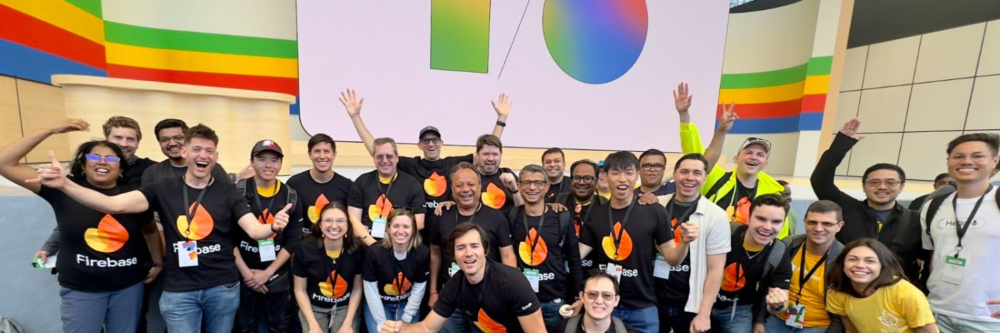

# Dmitry Lyalin

25+ years building stuff. Currently at Google as Group PM for Firebase - working on serverless products (Cloud Functions, Hosting, Storage, Extensions, App Hosting, Firebase ML) and our new AI framework, Genkit. Basically helping developers ship apps faster.

Led multiple products from zero to GA:
- **[Firebase App Hosting](https://firebase.blog/posts/2024/05/introducing-app-hosting/)** - Simplified serverless hosting for Next.js/Angular apps. No more config hell - just GitHub integration and automatic scaling.
- **[Firebase Genkit](https://firebase.blog/posts/2024/05/introducing-genkit/)** - Open-source AI framework for JS/TS developers. Making AI development as easy as Firebase made mobile backends.

Before Google: 14 years at Microsoft. Started as a dev consultant, ended up as Principal PM. Built Hot Reload for .NET/C++ (you're welcome!), shipped .NET MAUI 1.0, made XAML tools suck less, and helped rebrand VSTS to Azure DevOps. Also keynoted at .NET Conf and ran Build.

Started my career bouncing between banks, startups, and everything in between. Real-world experience that taught me developers just want tools that work. 

Beyond tech: 6.5 years as NYPD Auxiliary Police in NYC, now doing C.E.R.T. with Florida fire department. Community matters.

## 🤖 AI Coding Adventures

I'm all-in on AI coding tools - Claude Code, Cursor, Windsurf, Gemini CLI, Firebase Studio, Jules. Here's what I've built with AI assistance:

### Game Experiments
Zero game dev experience → playable prototypes in hours:
- [**Defend Ship**](https://dronedefense.web.app/) - Tower defense with boats. Has weather effects!
- [**Maze Explorer**](https://mazeexplorer-e2b48.web.app/) - Touch-friendly maze game
- [**Space City**](https://spacecity-350f9.web.app/) - Build colonies in space
- [**Solar Explorer**](https://solarexplorer.web.app/) - Solar system sim with debug tools

### Product Prototypes
As a PM, I build prototypes to explore concepts (not shipping these, but way better than just docs):
- [**Reimagined Firebase Hosting Docs**](https://hostingdoc-preview.web.app/) - Experimental docs site with AI-assisted deployment onboarding
- [**Voice-Powered Firebase Studio**](https://screen.studio/share/YmBw2pjG) (video) - Chrome extension that speaks code changes using AI summarization

### Open Source Samples
- [**TextNarratorDemo**](https://github.com/LyalinDotCom/TextNarratorDemo) - Text-to-speech with 30 voices and 24 languages. Built entirely with Firebase Studio prompts - includes auto-translation!
- [**learn-genkit-gemini**](https://github.com/LyalinDotCom/learn-genkit-gemini) - Using Gemini CLI to automate Genkit sample generation
- [**TextToSpeechGenkitDemo**](https://github.com/LyalinDotCom/TextToSpeechGenkitDemo) - Multi-speaker AI voice synthesis with Genkit
- [**Genkit-Ollama-VisionSample**](https://github.com/LyalinDotCom/Genkit-Ollama-VisionSample) - Local AI text extraction from images

### Developer Tools
- [**ConfigureMacKeys**](https://github.com/LyalinDotCom/ConfigureMacKeys) - "Just in time" CLI for managing Mac env vars with auto-backups

## 📫 Let's Connect

- **LinkedIn**: [dmitrylyalin](https://www.linkedin.com/in/dmitrylyalin/)
- **Twitter**: [@lyalindotcom](https://www.twitter.com/lyalindotcom)